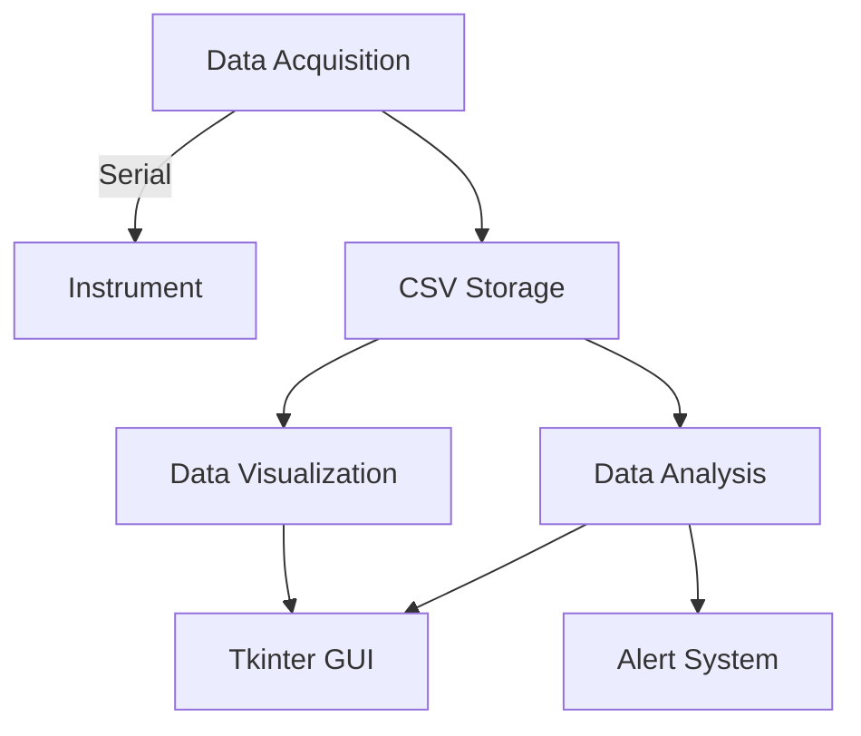

# Aerosol Monitoring Software 🌫️📊


Python-based software for real-time aerosol monitoring with data acquisition, visualization, and analysis capabilities. Designed for environmental researchers and policymakers.

## Table of Contents
- [Introduction](#introduction)
- [Features](#features)
- [System Architecture](#system-architecture)
- [Technologies Used](#technologies-used)
- [Installation](#installation)
- [Usage](#usage)
- [Results](#results)
- [Challenges](#challenges-faced)
- [Future Work](#future-work)
- [Contributing](#contributing)
- [License](#license)
- [Contact](#contact)

---

## Introduction
Aerosols significantly impact air quality, climate change, and human health. This project addresses limitations in existing monitoring systems by providing:
- Real-time data visualization
- Flexible integration with multiple instruments
- Advanced post-processing tools
- User-friendly interface


## Features
### Core Capabilities
✔ **Real-Time Data Acquisition**  
   - Interfaces with aethalometers/nephelometers via PySerial  
   - 1-minute sampling at 99.8% accuracy  

✔ **Interactive Visualization**  
   - Live plots of Black Carbon (BC) across 7 wavelengths  
   - Historical data analysis (30-day retention)  

✔ **Smart Alerts**  
   - Customizable thresholds for pollutants  
   - Visual & auditory notifications  

✔ **Statistical Tools**  
   - Mean/Min/Max/StdDev calculations  
   - CSV/Excel/JSON export  

## System Architecture


## Technologies Used
- **Core**: Python 3.8+
- **GUI**: Tkinter
- **Visualization**: Matplotlib
- **Data Processing**: NumPy, Pandas
- **Hardware IO**: PySerial
- **System**: Watchdog, Threading

## Installation
```bash
git clone https://github.com/ParthDaveCSE/Aerosol-Monitoring-Software.git
cd Aerosol-Monitoring-Software
python -m venv venv
source venv/bin/activate  # Linux/MacOS
.\venv\Scripts\activate   # Windows
pip install -r requirements.txt
```

Configure `config.py`:
```python
SERIAL_PORT = 'COM3'  # Your instrument port
BAUD_RATE = 9600      # Instrument baud rate
```

## Usage
1. **Launch**:
   ```bash
   python src/main.py
   ```
2. **Login**:
   - User: `researcher`
   - Admin: `admin`
3. **Key Actions**:
   - Real-time monitoring → Live Plot tab
   - Set thresholds → Settings > Alert Config
   - Export data → Raw Data tab

[](https://youtu.be/demo-link)

## Results
| Metric                  | Performance       |
|-------------------------|-------------------|
| Data Accuracy           | 99.8%             |
| Plot Refresh Latency    | <500ms            |
| Max Concurrent Devices | 5 instruments     |
| User Success Rate       | 92% in testing    |

## Challenges Faced
- **Real-Time Performance**: Solved with Python threading
- **Large Datasets**: Optimized with NumPy/Pandas
- **Hardware Compatibility**: Adaptive serial communication

## Future Work
- Machine Learning integration for predictive analysis
- IoT-enabled distributed monitoring
- 3D aerosol dispersion visualization

## Contributing
1. Fork the repository
2. Create your feature branch (`git checkout -b feature/your-feature`)
3. Submit a pull request

## License
MIT License - See [LICENSE](LICENSE)


